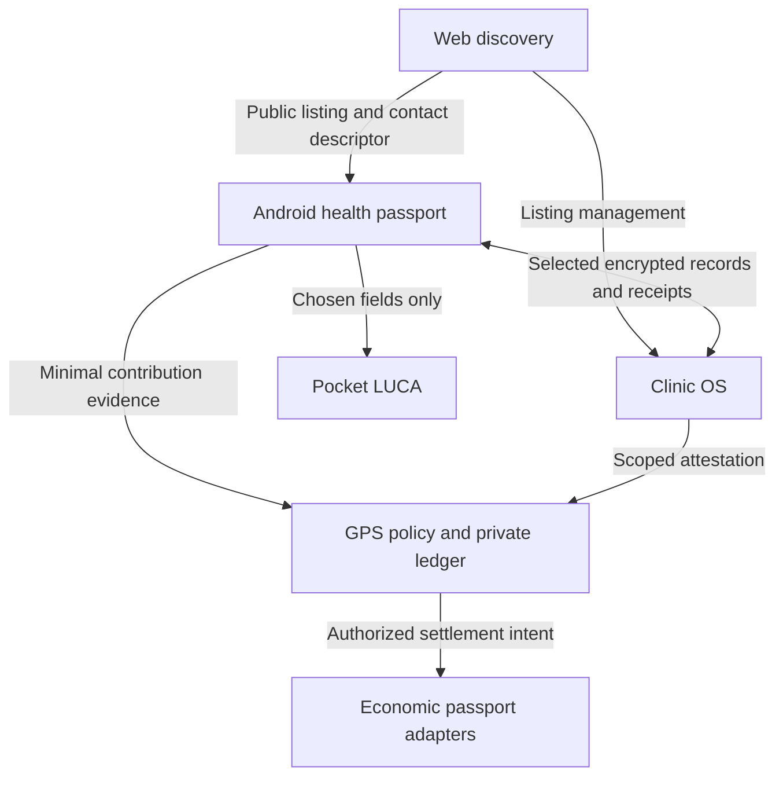

# Solaris products and trust boundaries

Updated 18 September 2026. **Target architecture, with current maturity stated explicitly.** This document does not activate cross-product access or financial features.

Solaris helps people own and understand their health information, connect with trusted care and participate in useful local economies. The Android health passport is the personal entry point. It should remain useful if a discovery server, model provider, transport or wallet adapter is unavailable.

## Product map

| Product | Job | Data/authority owner | Current status |
| --- | --- | --- | --- |
| Android health passport | Local vault, approved records, recovery, selected sharing | Patient/device owner | Recovered 604 prototype; native restoration and bounded chat candidate work |
| Pocket LUCA | Local assistance over an explicitly selected context | Delegated by the user, never root or wallet | Guided/local-generation paths exist; output, latency and device limits remain |
| Web discovery marketplace | Public provider/service discovery and minimal coordination | Solaris operates the public service; clinicians own their listings | Separate existing codebase; discovery isolation is a target requiring its own source/runtime evidence |
| Practitioner Clinic OS | Private care inbox, authored records, staff capabilities and local assistance | Clinic/practitioner | Planned software; begin with one supported installation |
| Clinic in a Box | Clinic OS plus supported hardware, networking, recovery and operations | Clinic operator with a defined support contract | Later productization, not prerequisite hardware for listing a practice |
| Economic Passport | Wallet endpoints, balances, contribution/settlement receipts | User owns wallet/history; a sponsor controls only its own authorized program budget/payouts | Planned optional module, separate from vault keys |
| GPS / Value Atlas | Governed contribution decisions and understandable private history | Accepted policy authorities; scoped issuers and recipients | Working-draft design; simulator first |
| Sovereignty discovery | Public business/community information and evidenced infrastructure claims | Source-specific publishers and verifiers | Optional future adapter; BTC Map is one input |

Aura can be the first proposed clinic pilot. Its operation as a dental practice does not prove that the software or its cryptographic/privacy contracts are ready for patient deployment.

## How the products connect

All arrows are proposed contracts. The drawing does not claim these integrations are delivered. An eligible contribution need not contain a clinical record. A clinic attestation must reveal only the fact required by the accepted program; it must not disclose treatment details to a public ledger.

Discovery should distribute public information and verified contact bindings without receiving clinical plaintext. A verified key proves control of that key; professional licensing and organization authority need separate verification. Confirm first sensitive connections and key rotations rather than trusting a directory entry alone.

The practitioner remains free to list a service through the web without installing the patient APK or purchasing a node. Private care functions require a suitable clinic-controlled endpoint. Browser access to private data needs an explicit key-custody and decryption design; a web interface is not automatically end-to-end encrypted.

## Four boundaries to implement once

1. **Identity continuity:** permanent private Subject ID, controller/device bindings, independent professional credentials and recoverable history. An npub or wallet address is an adapter binding, not the entire person.
2. **Health authority:** selected record IDs/revisions/fields, recipient, purpose, expiry, revocation and current authorization at use. Sharing creates a recipient copy; revocation cannot erase already copied plaintext.
3. **Evidence:** distinguish self-report, signed assertion, independently checked contribution, accepted allocation and settlement. LUCA explains evidence and asks for clarification; it cannot promote a model answer to verified fact.
4. **Economic execution:** explicit policy, asset/network, budget, recipient, amount, fees, approval and recovery. AI, discovery and replicated reducers hold no automatic spending authority.

Use one versioned shared contract package or a pinned vendored contract set across repositories, with cross-runtime conformance vectors. This is a proposed organization; do not create a new repository or fork inconsistent schemas merely to make the directory layout look complete. Existing Android and web repositories keep independent release/deployment boundaries.

## First complete user journey to prove

A synthetic adult user discovers a public clinic listing, verifies the clinic contact, selects one synthetic record on Android, approves the purpose and recipient, transfers it and receives an acknowledgement plus reply. A receptionist sees only the permitted inbox; the practitioner sees the selected material. Revoke one staff device, restart the clinic, restore both patient and clinic to clean test installations and demonstrate that discovery outages do not lock the patient's existing vault.

Add an optional **shadow** contribution receipt after this private workflow is proven. It records what was evidenced and which policy would apply, without paying funds, issuing a transferable health reputation or publishing a patient-clinic relationship.

## What to keep out of the first integration

Do not build a comprehensive electronic health record, multi-chain wallet, public health reputation graph or autonomous spending agent as part of the first inbox. Keep general-purpose medical generation outside Pocket LUCA's supported contract until its evidence justifies the scope. Optional remote inference requires a separately disclosed selected-context processing path; it must not silently route through the public discovery backend.

See [Roadmap](ROADMAP.md), [GPS/RGB contract roadmap](GPS-RGB-CONTRACT-ROADMAP.md), [P2P/wallet research](research/P2P-WALLET-EVIDENCE-2026-09-18.md) and the [engineering report](reports/Solaris-Engineering-Progress-and-Ecosystem-Report-2026-09-18.md).
