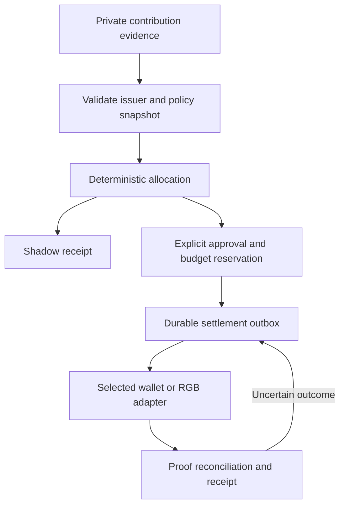

# GPS policies, contracts and optional RGB integration

Status: **engineering proposal / no policy activation / no financial execution**. Updated 18 September 2026.

## Purpose and source authority

**GPS means Global Prosperous Split.** It is Solaris's policy, allocation, settlement and receipt protocol for recognizing contribution. It is not phone geolocation. Coarse location, when useful for a particular feature, requires its own purpose and permission.

This proposal reconciles the July `GPS_Protocol_Complete_Combined_v1.0.md` working draft, September Android/web identity plans and the September 16 sovereign-architecture roadmap. Their hashes and detailed discrepancies are in [Existing policy reconciliation](research/GPS-EXISTING-POLICY-RECONCILIATION.md). Normative language in a draft is not proof the profile has been accepted or implemented.

Keep the ten canonical domains: user sovereignty; community/referral lineage; sovereign infrastructure; open technology/security; intelligence/knowledge commons; regenerative land/food/water/energy; public-benefit causes; education; regenerative health fund; and local public goods. These are categories for governed allocation, not ten fixed wallets. A profile can exclude a category; the consultation example excludes referrals. Listing categories here activates no referral compensation or payout.

## Policy reconciliation before code

| Existing rule/example | Engineering treatment |
| --- | --- |
| Standard GPS envelope at most 10% of defined eligible value | Enforce the cap only within an explicitly accepted profile/basis; classify commercial value, fees, taxes and voluntary gifts separately. Never invent a new rate in code. |
| Showcase coordination inside GPS versus consultation 86/4/10 outside-GPS coordination | Separate named historical profiles with different accounting meaning; both disabled until their activation decisions and vectors are explicit. |
| One root `ValueEpisode` | Child agents/tools reference the same episode. Routing an entitlement does not create another revenue event or another full GPS charge. |
| July example rows total 9% while text claims 10% | Preserve original evidence; correct a future executable vector through review. Reject nonconserving allocations rather than silently normalize. |
| Broad voluntary cascade versus detailed routing limits | Resolve profile-level maximum cascade, minimum retention, depth/edge limits and cycle rules before ratification. Do not select the most permissive wording. |
| Required context hash in an older receipt | Do not publish predictable clinical hashes. Minimize or omit sensitive context; any hiding commitment requires a reviewed design. |

## What belongs in which contract

These record names are proposed interface responsibilities, not a claim that schemas already exist. Reuse compatible established project records where they exist and freeze one shared version across consumers.

| Record/layer | Required responsibility | Enforcement location |
| --- | --- | --- |
| `ConsentGrant` / capability | Selected record IDs/revisions/fields, recipient, purpose, scope, expiry, grant version, revocation | Patient vault and recipient boundary, not RGB ownership |
| `ContributionEvidence` | Stable evidence ID, scoped actor, type, occurrence bounds, evidence grade, issuer/attestor and minimal private references | Evidence verifier with explicit trust assumptions |
| `ValueEpisode` | One root eligible-value event, asset/units and references for child work | GPS engine and ledger |
| `PolicySnapshot` | Accepted profile/version/hash, basis, limits, effective time, permitted evidence/attestors, funding, rounding and dispute rules | Deterministic resolver input |
| `AllocationManifest` | Finite recipient graph, exact integer outputs, conservation, cap, reason codes and source snapshot | Pure resolver plus independent verifier |
| `ActionApproval` | Authorized payer/sponsor, destination, amount/asset/network, fee limit, expiry and current authority | Signer/settlement boundary |
| `OutboxAction` | Reservation, stable idempotency key, attempted/submitted/uncertain/confirmed states and reconciliation | Durable private ledger; never a replayable reducer side effect |
| `SettlementReceipt` / correction | Actual rail proof, paid/pending/fees/refunds, policy and episode linkage | Adapter proof validation and append-only history |
| Optional RGB adapter | Pinned implementation, schema/contract IDs, supported asset transitions, consignment validation and recovery | RGB client-side validator and isolated wallet state |

A proposed JSON encoding must reject duplicates/ambiguous values, define canonical bytes, domain separation, algorithm labels, bounded sizes and integer units. [RFC 8785](https://www.rfc-editor.org/rfc/rfc8785) is one canonicalization option, not a signature scheme. Use established cryptographic libraries and jointly reviewed test vectors rather than a new ad hoc signing protocol.

## Execution sequence

The shadow path moves no funds. The funded path is a later separately accepted task. A retry reuses/reconciles the existing intent; an uncertain result does not justify a second payment. Failed settlement preserves the recipient's pending entitlement, with no silent reassignment to platform revenue.

The evaluator must not use a language model to choose amounts or invent facts. It can accept only evidence types and issuer trust authorized by the policy. Self-reported progress is labelled self-report. Reward programs should not require medical disclosure, penalize illness, treat a health score as verified improvement or promise returns without a named funder and finite budget.

## RGB's specific role

[RGB schemas](https://docs.rgb.info/rgb-contract-implementation/schema.md) describe asset state and permitted transitions. Client-side validation checks relevant history under those rules. Bitcoin commitments do not check a patient's record, attest that treatment occurred or implement a clinic's access-control policy.

Use RGB only for rules that the selected compiled validator demonstrably enforces. Referencing a GPS policy hash in metadata does not make the policy executable. Health sharing remains controlled by identity and consent contracts even if a user holds an asset or service credit. Revoking a credential or permission does not undo a settled transfer or delete an existing recipient copy.

Current research found distinct RGB 0.11.1 and RGB-WG 0.12 development lines. WDK documents community on-chain RGB and a separate RGB-Lightning module with different native coverage and state. Breez Spark is a different rail. Do not assume version compatibility, automatic bridging, token equivalence or a common recovery procedure. See the [version-specific research](research/RGB-GPS-EVIDENCE-2026-09-18.md).

First RGB lab: one synthetic service-credit asset, one pinned supported schema/network, no patient identifiers, and issue → receive → verify → transfer → supported redemption/correction → export → clean restore. Prove interoperability with an independently selected compatible implementation. If a desired transition is unsupported, document it; do not fake it in UI. Removing the adapter must leave vault access intact.

RGB state/consignments and Lightning channel state have recovery requirements beyond a seed. Use one active wallet-state writer and deliberate migration; do not merge live wallet directories through P2P/CRDT replication. No economic-passport UI may imply otherwise.

## Acceptance phases

1. **Contract fixture set:** accepted profile registry, clear draft/accepted/deprecated status, frozen synthetic episode/evidence inputs and expected bytes. No funds or wallet dependency.
2. **Shadow evaluator:** cross-runtime deterministic results; conservation, cap, cycle, duplication, overflow, budget-contention, policy-downgrade, revoked-attestor and stale-authority tests. Show intended allocation separately from paid value.
3. **One wallet test adapter:** recipient/asset/network/fee validation, explicit approval, crash after submission, uncertain outcome reconciliation, clean restore and repeated-intent tests. Use the test environment actually supported by that rail; do not assume all SDKs support the same regtest setup.
4. **Optional RGB lab:** version/schema incompatibility, malformed/partial consignment, state backup/restore, wrong-network and concurrent-writer rejection; independent review of selected asset semantics.
5. **Bounded funded pilot:** one accepted program, named funder/operator, capped budget, narrow attestors, dispute/correction process and independently verified operating/recovery controls. Future decision, not authorized by these docs.

Additional invariants: clinical plaintext and linkable health hashes stay out of public receipts, code, AI diagnostics and merchant maps; public aliases are not automatically joined to private identities; offline verification does not pretend to know fresh revocations; funds never move from `Autobase.apply`; economic replay cannot re-charge the episode; health access does not depend on participating in rewards.

## Product presentation

The Economic Passport may display one coherent history while accurately naming different assets, networks, states and recovery responsibilities. The Value Atlas may summarize private or appropriately aggregated contribution history, but payment is not proof of medical benefit. BTC Map can support public merchant discovery; separate attestations are needed for practitioner licensing, sovereign infrastructure and eligible GPS contribution.

Proposed README statement: **“GPS is a planned contribution-policy and rewards layer. Initial work validates minimal evidence and deterministic policies without moving funds. Optional RGB contracts and wallet adapters require separate compatibility, recovery and authorization testing.”**
