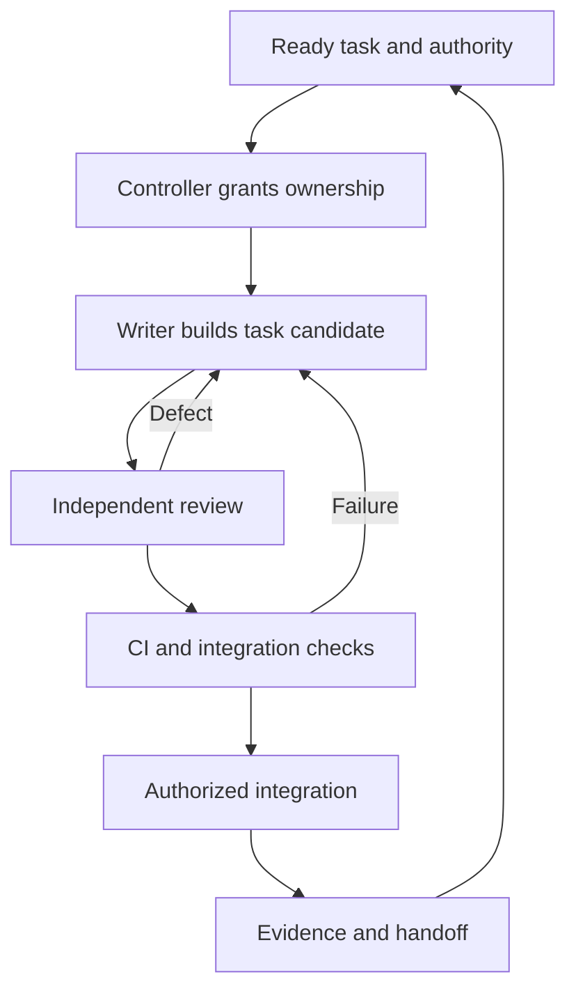

# Solaris / LUCA — practical multi-AI delivery plan

Prepared 14 September 2026 for Majd. This updates the 13 September operating plan. Status: architecture, operating instructions and activation proposal; no product source, repository rules, hosting, phone installation or schedules changed. The reusable `multi-ai-delivery` skill is maintained separately.

## Start with this decision

Keep the **two official ChatGPT chats** as Web Lead and APK Lead. ChatGPT remains the high-context planner and orchestrator. GitHub stores the agreed work and evidence. Copilot is the main implementation worker; Claude provides independent code/security review; Gemini Spark provides product/research review; MiMo Claw organizes evidence and memory. Use Google's Jules only when a Google coding worker is useful and Spark's actual account cannot provide the needed GitHub capability.

Use **one source repository with distinct web/native areas**, provided the recovered native source's licensing and access permit it. Give every coding task a separate temporary branch. Make the mapped preview branch a reviewed integration destination. Do not place the APK permanently on a parallel product branch or put several AI writers in one checkout.

Begin with one writer and one reviewer. Extra subscriptions should supply distinct useful work, rather than mandatory participation in every change. No new subscription is required to prove the first small workflow.

## 1. What we know now

| Item | Evidence as of this plan | Meaning |
|---|---|---|
| GitHub repository | Fresh connected API: `TheMajicCode/solaris-health`, public, default `main` | Source is public; private planning/operational details must not be uploaded indiscriminately. |
| Main revision | Fresh API: `09d6e6a43e751d31d06080e45364113a69759b1b`, commit dated Sep 13 | The earlier Sep 3 `79f10b2` is no longer current main. This does not identify deployed runtime. |
| Connected account | Fresh repo metadata reports `push: true`, `admin: true`; GitHub mutation tools are exposed | Earlier blanket “no write access” is outdated. A real branch write has not been attempted in this planning task; token scopes/rules may still restrict it. |
| Open work | Fresh PR search returned no open PRs; branch listing returned 28 entries | Unpublished work in the official chats is still separate evidence. |
| Preview identity | Branch search found `agent/solaris-preview-v3-navigation-ui-fixes` and `agent/abacus-spark-wallet-preview-v1` | A hostname is not a Git branch. The correct deployment mapping remains to be proved; do not invent a branch named `preview`. |
| Web identity candidate | Sep 13 `Solaris-WEB-ID-SHARED0-Handoff.md`: eight added paths, fixed-fixture conformance checks, database gates blocked, no commit/push/deploy | Continue the candidate. Fixture recognition always denies live authority; it is not account linking, a general verifier or a production wire protocol. |
| Earlier web repair | Sep 13 operating plan records WEB-R1 context isolation and DOCS-EVIDENCE-R2 as reviewed local work | Reconcile the actual surviving patch before assigning another model the same fix. |
| Android newest retained reference | Later Sep 13 `START-HERE.md`: `6.0.1-preview.sanctuary`, code601, APK-derived recovery | Supersedes code600 as latest recovered reference. It is not original authored native source or proof of current phone installation. |
| Native blocker | Same later handoff: missing original coordinator/compiler, Kotlin/native project, dependency lockfile and build configuration; matching development-signing provenance exists | Recover genuine source. Do not repeat the older blanket signing-blocker claim or rebuild from D4. Signing custody still requires secure verification at release. |
| Hosting | Historical operator report describes shared API/database between preview and public domains | Treat this as an unresolved isolation risk, not fresh live inspection. No state-changing acceptance tests or automatic deploy until resolved. |

Code601's recorded APK SHA-256 is `228c3d9f282d716515e3640de2b13478a29e21c607293eaf589741ec6d34f183`; package `org.solarishealth.edge.recovery`. The binary was not rehashed here. Do not uninstall/reset the existing app, replace its keys, redownload valid models, or keep asking for the source ZIP Majd could not download.

Sources: [current main](https://github.com/TheMajicCode/solaris-health/commit/09d6e6a43e751d31d06080e45364113a69759b1b), retained handoffs named above, and fresh connected GitHub reads. The detailed Sep 12 identity plans remain design references, subordinate to newer accepted contracts and evidence.

## 2. How the products work together

| Person | Interface | Required services | Optional services |
|---|---|---|---|
| Patient | APK, web, or both | None for already-provisioned offline vault access | Solaris API, permitted remote AI, device P2P, payments |
| Practitioner | Web only | Network account and authorized practitioner workflow | Clinic OS subscription |
| Clinic using Clinic OS | Web | Clinic operations under its tenant | Later clinic node / clinic in a box |
| Future clinic node | Infrastructure behind the web experience | Only the services the clinic elects to operate | Native P2P, encrypted backup, approved local inference |

Solaris API coordinates practitioner discovery, booking availability, account association and authorized exchange. Patient APK retains local vault access and local LUCA. Practitioner listing, professional qualification, clinic membership and paid Clinic OS access are distinct checks. A practitioner never needs an APK or hardware purchase to be found.

An ordinary browser cannot directly run raw Hyperswarm sockets. Start practitioner sharing through HTTPS; later connect a browser-facing gateway to native P2P. WebRTC is another possible adapter and needs its own authentication/signaling tests. [Chrome Direct Sockets](https://developer.chrome.com/docs/iwa/direct-sockets)

Preserve the private permanent Solaris Subject ID. Keet-style owner/device proofs, Nostr and wallet addresses are replaceable bindings. Linking an existing web identity to an existing APK identity requires control of both and a reviewed association process; names or matching email are insufficient. WEB-ID-SHARED0's first-controller fixture does not solve two-existing-subject association.

Own-device sync replicates selected owner records. Practitioner sharing sends a selected disclosure to a named recipient under a purpose and expiry. It never grants unrestricted access to the owner's vault. Corrected clinical documents preserve authorship and prior versions. Offline bookings remain requests until confirmed. Revocation prevents future access but cannot erase already received copies.

GPS remains one deterministic evaluation per root ValueEpisode under the accepted policy profile. P2P replays must not trigger payouts. Wallet/RGB/Lightning state has separate recovery and controlled live ownership; never merge it like notes. See the separate integration map for the complete data and failure rules.

## 3. Repository decision and native import

Choose one repository initially because both interfaces need synchronized identity, questionnaires, consent, exchange schemas and tests. Keep the current React/Vite root and Express backend. Preserve `edge/apps/edge-mobile` if that is where the genuine recovered project belongs. Do not reorganize working code to fit an ideal directory diagram.

The existing candidate uses `shared/identity-conformance/`. Preserve its exact fixture bytes. Add future protocol artifacts alongside it only under an accepted cross-app contract. Do not create a competing `packages/protocol` signing specification simply because the older plan suggested that directory. A package extraction can follow demonstrated reuse.

Separate native repository is the fallback if private native source, license restrictions, signing/release ownership, or practical build isolation requires it. Confirm that before importing into this public repository. In that case, publish reviewed protocol versions with immutable digests and consumer compatibility checks. Avoid a third contracts repository until necessary.

| Git concept | Beginner meaning | Solaris usage |
|---|---|---|
| Repository | Shared source/history cabinet | One coherent project, with different application folders |
| Branch | Temporary working copy in history | One task, one accountable writer |
| Commit SHA | Exact saved revision identifier | Identifies what was tested/reviewed |
| Pull request | Proposed change with review | The integration gate |
| CI / Actions | Automated verification jobs | Build/test/security evidence |
| Preview deployment | Running staging application | Must have known source and safe isolated data |
| Codespace | Browser-accessible development computer | Optional interactive terminal, not the coordinator |

Native import sequence: recover newest authored source; inspect archive paths without overlays; record provenance/package/version/locks; reconcile newer UI/lifecycle candidates; retain the original build process; check licenses and secrets before public import; build in an isolated cloud job; record source-to-APK mapping and certificate fingerprint; later test a data-preserving forward update on the phone under its own task. Store big APK/model artifacts outside ordinary Git history with checksums and retention. Do not put signing keys in GitHub source or chats.

## 4. People and AI roles

| Role | Owns | Expected output |
|---|---|---|
| ChatGPT orchestration | Priorities, architecture, cross-app contracts, admission decisions | One current task and evidence index; clear acceptance criteria |
| ChatGPT Web Lead | Web/API workstream and host handoff | Current source/host mapping; precise worker task; reviewed next step |
| ChatGPT APK Lead | Native recovery and local app workstream | Genuine source/build evidence; stable local workflows; device acceptance |
| Copilot cloud agent | Bounded implementation | Task branch, minimal complete change, tests and draft PR when authorized |
| Claude Pro / Claude Code | Independent source/security review | Findings tied to exact candidate, reproducible cases and limits |
| Gemini Spark | Journey consistency, architecture research, EN/ES wording review | Evidence-backed UX/compatibility report; no invented runtime claims |
| Jules, optional Google coding lane | Concrete test/implementation task | Own branch/PR; same gates as Copilot |
| MiMo Claw | Administrative memory and evidence organization | Source-linked summaries, blockers, stale-owner alerts, exported records |
| Trusted CI/controller | Ownership, check execution and constrained publication | Enforced state transitions and exact-revision evidence |
| Majd | Product/policy decisions and release exceptions | A small batch of concrete decisions, not routine status babysitting |

Use your requested **Ultra** effort in ChatGPT where that actual model/surface exposes it, especially architecture, recovery and cross-app review. A prompt cannot change a unavailable setting, grant tools or promise unlimited context. Record the effective model/effort when exposed. Routine deterministic checks and indexing do not need an Ultra model call.

GitHub-hosted Claude/Codex consume GitHub's allowance; they do not inherit your separate Claude Pro or ChatGPT memory. Using Claude Code with its supported Pro sign-in and Codex with ChatGPT is how those separate subscriptions can contribute. Never transfer provider login cookies into MiMo. [GitHub third-party agents](https://docs.github.com/en/copilot/concepts/agents/about-third-party-coding-agents), [Claude Pro support](https://support.claude.com/en/articles/11145838-use-claude-code-with-your-pro-or-max-plan)

## 5. A factory driven by completion

Plan → reproduce/test where relevant → implement → independent review → verify → remember → propose improvement. Build meaningful tests for changed behavior. Do not add imitation tests for a document edit. A review applies to one exact revision; subsequent code changes invalidate it.

Use completion events where possible and one **hourly watchdog** initially. A 30-minute controller check is possible through Actions later, but it should usually run no model at all. Each tick asks whether there is eligible work, an active owner, unmet dependencies, a paused queue or an exhausted allowance. Empty/blocked queue means exit.

Do not alternate ChatGPT, Claude and Gemini by the clock. A native build may last beyond the next slot. The writer retains ownership until a persisted candidate or controlled cancellation. Claude reviews when a candidate exists, Gemini examines relevant journeys after a preview exists, and MiMo records completed evidence.

Start with one writer total. After claim enforcement works, allow one web and one APK task on disjoint paths. Shared schemas, lockfiles, migrations and release plumbing require exclusive ownership. An expired lease does not prove a worker stopped: cancel/revoke or confirm exit, quarantine late results and use a fresh branch for a replacement. Fence accepted results by task/run/generation and expected SHA.

One serialized controller and conditionally updated durable state must enforce claims. GitHub labels, instructions and timers are not distributed locks. Actions concurrency controls its jobs, not external provider sessions. If credentials cannot restrict a worker, use read-only workers returning patches and a trusted publisher. [GitHub concurrency](https://docs.github.com/en/actions/how-tos/write-workflows/choose-when-workflows-run/control-workflow-concurrency)

Pilot budget recommendation: one task per run, one writer, 45-minute checkpoint, at most two repair attempts, zero paid overage, no model calls on idle ticks. Long native builds get a separately bounded job. Record actual usage and stop at the limit. These are proposed settings, not activated ones.

## 6. Current service constraints

Copilot Max currently exists at $100 USD/month; it increases capacity, while lower paid plans also provide cloud-agent access. Codespaces compute/storage and Actions minutes are separate considerations. Your current subscriptions can prove the first workflow before adding capacity. [Copilot plans](https://docs.github.com/en/copilot/get-started/plans)

**The current Solaris repository is public, while Copilot's native scheduled automations currently require private/internal repositories.** Manual cloud-agent tasks remain useful. Keep the repository's chosen visibility. Use an independently configured controller or supported provider routines for later automation. [Copilot automations](https://docs.github.com/en/copilot/concepts/agents/cloud-agent/about-automations)

Claude Code cloud Routines support Pro, with an hourly minimum and usage caps. Gemini Spark is real and supports scheduled general tasks; its direct GitHub writer was not established by the inspected documentation. Jules is Google's documented GitHub coding agent. MiMo Claw's actual repository permissions and retention must be demonstrated in its own account. [Claude Routines](https://code.claude.com/docs/en/routines), [Gemini Spark](https://gemini.google/overview/agent/spark/), [Jules](https://jules.google/docs/usage-limits/), [MiMo Claw](https://mimo.mi.com/docs/en-US/updates/feature/claw)

Codex cloud can run background coding work from the web in repository environments, so a working laptop is not required. Work scheduled tasks can use connected tools; a desktop task needing local files requires that computer running. Neither automatically controls Claude/Spark/MiMo chats. [Codex cloud](https://learn.chatgpt.com/docs/cloud), [Scheduled tasks](https://learn.chatgpt.com/docs/automations?surface=app)

## 7. Quality, security and memory

Adopt ECC's focused planning, independent review, bounded repair loops and evidence handoffs. Use the accompanying portable instruction cards for Playwright, Solaris design, native recovery, security and memory. ECC's Copilot adapter is instruction-only; experimental Gemini/OpenClaw adapters do not prove Spark/MiMo compatibility. No installer/hooks were run. Exact current upstream SHA must be captured before code adoption. [ECC](https://github.com/affaan-m/ECC)

CI executes untrusted candidate code in disposable environments with synthetic data. Keep release keys and production credentials outside workers. Protect CI/policy and avoid privileged checkout of untrusted PR code. Require checks on the actual integration candidate, with a merge queue where supported or one serialized integrator. [GitHub workflow security](https://docs.github.com/en/actions/reference/security/secure-use)

Security work includes source review, dependencies/secrets/config scans, negative authorization tests and separately scoped dynamic testing. Begin with cross-account/clinic isolation, identity replay/revocation, import/model integrity, AI data egress, consent and GPS duplicate effects. Plan active penetration tests only against named isolated owned targets with synthetic accounts, rates and stop conditions. This pack does not claim a penetration test occurred.

MiMo maintains an index, not a rival source of truth: vision/accepted ADRs; task queue; exact source and deployed-artifact map; handoffs; blockers; release evidence; proposed lessons. Every claim includes date, source and confidence/evidence type. Full chats, patient data, secrets, private identity graphs and operational vulnerabilities do not belong in the public repository. Private evidence storage should retain digests/access-controlled links. Learned suggestions cannot silently alter policy, security rules or GPS economics.

## 8. Sequence from here

| Order | Task | Who starts | Exit evidence |
|---|---|---|---|
| 1 | FLOW-0 reconciliation | Both official ChatGPT leads | Latest actual source/dirty candidates; no duplicated WEB-R1/SHARED0; native source gap recorded |
| 2 | FLOW-1 limited authorization | Majd reviews the supplied concrete charter | One bounded pilot approved; existing governance reconciled |
| 3 | FLOW-DOC0 write pilot | Copilot or connected ChatGPT writer, one selected | Two documentation files on isolated branch; independent review; actual push and draft PR proof |
| 4 | Finish current web evidence gates | Web Lead + worker + Claude | Reuse WEB-R1/SHARED0 candidates; disposable DB and required baselines; no false production claims |
| Parallel | APK-SOURCE-1 | APK Lead | Original native source/build inputs recovered, or exact continuing blocker; no older reconstruction |
| 5 | CI-1 controller/verification pilot | Web Lead + Claude | Enforced single claim, stale-result rejection, trusted check provenance, no production secrets |
| 6 | PREVIEW-1 isolation | Authorized Abacus/host operator | Separate API/database/credentials, explicit migration policy and rollback/restore evidence |
| 7 | A1 local reliability + shared contract | APK Lead and Web Lead | Preserved model/vault; real EN/ES text reply; conformance and identity/recovery evidence |
| 8 | CROSS-I1 API share loop | Both leads | One selected synthetic record to a browser practitioner and one attributable return record |
| 9 | Own-device P2P and later node | APK Lead, then shared lane | Same permissions/envelope; offline/replay/revocation/restore checks |
| 10 | AUTONOMY-1 | Verified controller | Limited scheduled delivery under an accepted budget, with daily exception summary |

RGB research can run as a small isolated research task; it is not a dependency of source recovery, local LUCA or first practitioner exchange. Funded GPS, wallet migration and clinic hardware come after their specific recovery/security gates.

## 9. First actions for Majd

1. Open GitHub in your phone browser, sign in, and open `TheMajicCode/solaris-health`. You do not need to buy a laptop first. Use the paid plan you already choose; Max is capacity rather than a universal shared computer.
2. Read the short activation charter. It explains the only approval needed for the first documentation pilot, because current `AGENTS.md` and `WORKFLOW.md` explicitly split commit/push/PR authority. It does not activate an unattended coding factory.
3. Give each official chat its section of `Solaris-ChatGPT-Instructions-2026-09-14.md`. Give Copilot its file and one accepted task, not the full backlog. The first task checks actual write delivery with harmless documentation.
4. Give Claude its role file plus the resulting exact candidate. Give Spark and MiMo their onboarding prompts; they can produce useful read-only capability/evidence reports immediately.
5. After one complete pilot, implement the small controller and CI gates. Activate schedules after that evidence exists. Use the daily summary for exceptions and decisions; routine empty checks should remain quiet.

Call the reusable skill in another chat with: `Use $multi-ai-delivery to coordinate Solaris from the newest accepted source, handoffs and task records.` For another project: `Use $multi-ai-delivery for this repository, using this project's own policies.` On mobile: sidebar → Plugins → Skills.
