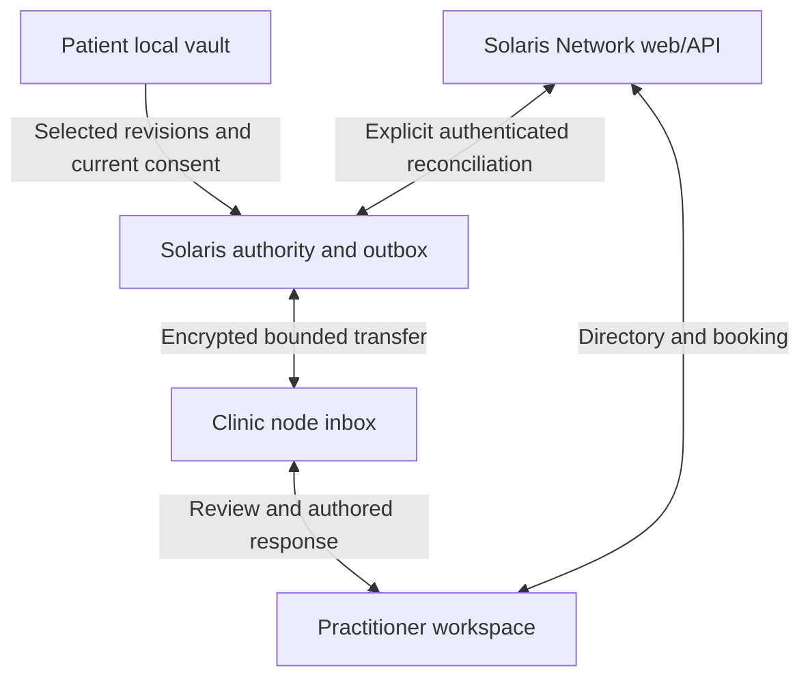

# Solaris: grounded Pear, Holesail and Buzz adoption

Date: 15 September 2026. Status: reviewed architecture and continuation contract; no new APK or production transport implementation.

## Decision

Use the Holepunch mobile ecosystem as the preferred candidate for Solaris's future P2P services while preserving the existing Android application. Pear is not limited to desktop: its mobile route uses Bare inside a native host. Solaris already has a Bare/QVAC integration. The next native change remains the A1 lifecycle and request-budget repair; networking cannot compensate for a broken local engine. [Pear mobile guide](https://docs.pears.com/how-to/run-on-native/embed-bare-in-react-native/)

Adopt source-backed patterns and pin tested components. Do not infer production readiness from a product description, repository presence or unrelated successful build. Every Solaris build now includes review and targeted verification under `BUILD-CYCLE-REVIEW-CONTRACT.md`.

## What each reference contributes

| Reference | Verified evidence | Proposed Solaris role |
|---|---|---|
| Pear / Bare | Official RN/Expo mobile embedding; current source has worklet AppState handling. Desktop uses an Electron/Bare architecture. | Portable P2P/storage services behind the existing Android UI; optional headless clinic companion and later desktop UI. |
| Hypercore / Hyperswarm | Replication and encrypted peer connectivity building blocks, with separate storage, discovery and encryption choices. | Selected, authorized record revisions and resumable own-device synchronization. Solaris supplies identity, consent, freshness and conflict policy. |
| Holesail | Published mobile apps and service-tunnel implementation; exact 2.x release and 3.x development APIs differ. | Optional temporary access to an authenticated clinic-owned service; test with synthetic data and owned endpoints first. |
| Buzz | Tauri/React desktop; Flutter mobile source and successful upstream Android debug build/tests at the inspected commit; desktop assets in the reviewed public release. | Clinic team workflow, local startup, agent permission broker, cancellation and bounded conversation/provider patterns. |

Sources: [Pear desktop](https://docs.pears.com/explanation/pear-desktop-architecture/), [Hypercore](https://docs.pears.com/reference/building-blocks/hypercore/), [Hyperswarm](https://github.com/holepunchto/hyperswarm), [Holesail mobile downloads](https://holesail.io/download), [Buzz pinned source](https://github.com/block/buzz/tree/7c789dee09d198469bded1cb5be902eaf5562ad9), [Buzz mobile CI](https://github.com/block/buzz/actions/runs/34903071307/job/104173606697).

Buzz is therefore no longer desktop-source-only, but mobile source/CI does not establish a shipped, phone-accepted release. Its normal workspace events remain relay-authoritative. It also has distinct iroh inter-relay transport and optional desktop Mesh-LLM compute. Neither proves Solaris patient-vault replication, and neither requires us to add Flutter, Tauri or iroh to the APK. Its information-flow proposal is explicitly draft. The overall inspected CI was not uniformly successful. Details and pinned links are in `evidence/BUZZ-AUDIT.md`.

## The Clinic in a Box direction

Start with an optional clinic-owned companion service attached to the existing Clinic OS/web workflow. Its first job is a selected-record inbox and outbox with durable receipts. It can later host local search, larger-model inference and practitioner coordination. A Pear desktop console can supervise that service when useful; rebuilding a full desktop clinic application is not the prerequisite.

Patients retain an offline private vault and can use Android, web, or both. Practitioners can continue using Solaris Network for their profile, services and bookings without installing an APK or buying a clinic node. The node is an optional ownership and compute choice.

This is a proposed architecture. Ordinary directory/booking traffic and optional health sharing have separate permissions. A website handoff is not native API integration, and the existing web server is not automatically end-to-end encrypted.

## First useful patient-to-practitioner flow

1. Patient records a check-in locally. AI and connectivity may both be off.
2. Patient chooses the practitioner, exact record revisions/date range, purpose and expiry. Show a preview before approving.
3. Independent Solaris code checks current authority, recipient, continuity and consent, then releases only the approved encrypted payload. Discovery topics contain no health data or raw permanent ID.
4. The clinic inbox validates the envelope and preserves source identity, raw schema, timestamps, units and provenance. A durable recipient receipt establishes acceptance; a connected socket does not.
5. Practitioner authors a separate response/correction. The patient reviews the return before importing it. Neither party silently overwrites the other's records.
6. Reconciliation preserves native 1–5 self-reports and web 1–10 fields as separate source contracts. Conflicts are visible; no automatic account merge or score conversion occurs.

Use the already proposed shared identity/operation matrix, not a new identity invented by a networking library. Nostr remains optional. Device membership, practitioner qualification and permission to view a specific record are separate claims. Revocation stops current and future unauthorized transfers; new encryption epochs exclude revoked devices from future content, but cannot recall previously received plaintext.

## Holesail adoption boundary

Holesail deserves a bounded trial as a way to reach a clinic service. Its released private tunnel mode uses a shared tunnel seed/keypair, so invitation possession is bearer access rather than an individual Solaris device identity. The newer server/client development branches change invitation APIs and are not the released mobile implementation. Use independent ephemeral tunnel credentials, explicit loopback bindings and authenticated application endpoints. Do not expose the whole clinic service surface to every patient.

Its components declare AGPL-3.0; review the proposed integration's license/notice obligations before embedding code. This differs from inspected Apache-2.0 Bare/Buzz source. We have not opened a tunnel or installed a Holesail app. [Pinned Holesail package](https://github.com/holesail/holesail/blob/3bcce0a8e6fdcba8b5b41f8b7db2f0f0b955a70b/package.json), [released server](https://github.com/holesail/holesail-server/blob/2.4.0/index.js), [released client](https://github.com/holesail/holesail-client/blob/2.3.0/index.js).

## LUCA and optional clinic compute

Keep compact on-phone conversation and approved local context available first. Borrow Buzz's explicit history, separate provider state and permission-broker patterns. For Solaris, bound context by actual compiled token/byte limits and reject stale/cancelled results. The model proposes actions; independent code validates current session, source scope and arguments just before execution.

A larger model on a clinic computer is a plausible optional next capability. The patient must explicitly choose that named endpoint and approved data; its hardware then processes that data outside the phone. No automatic cloud or clinic fallback follows from an engine failure. Benchmark selected models, memory, latency and multilingual quality before recommending or shipping one. Neither Buzz's optional Mesh-LLM source nor a working tunnel proves compatibility with QVAC. [Buzz permission broker](https://github.com/block/buzz/blob/7c789dee09d198469bded1cb5be902eaf5562ad9/crates/buzz-agent/src/permission.rs), [optional compute runtime](https://github.com/block/buzz/blob/7c789dee09d198469bded1cb5be902eaf5562ad9/desktop/src-tauri/src/mesh_llm/mod.rs).

## Next implementation sequence

| Slice | Concrete deliverable | Acceptance before advancing |
|---|---|---|
| A1 repair | Real host lifecycle reconciliation and prompt-budget feedback in the newest authored source; existing model reused | Independent diff review; targeted lifecycle/cancellation regressions; signed compatible APK; separately recorded close/reopen and chat device test |
| A2/A3 | Jointly frozen identity/proof bytes and actual native/web adapters | Cross-runtime vectors, wrong-recipient/account, replay, restore, rotation and revocation checks; existing offline access retained |
| A4 | Typed short-lived LUCA capabilities and named GPS SHADOW policy | Current-authority recheck and durable idempotency; synthetic receipts only, zero funds |
| A5 lab | One encrypted synthetic note, phone to owned desktop endpoint, in separate storage; no health data | Pause/resume, restart, duplicate receipt, offline/reconnect, expiry/revocation and conflict tests; record exact platform/pins |
| Clinic inbox | One patient-selected record and practitioner-authored return | Consent preview, provenance-preserving import, durable receipt, recipient validation and explicit conflict resolution |
| Optional adapters | Holesail test service access, clinic compute, Pear desktop console | Each has its own bounded contract and lifecycle/access tests; none is required for core vault access |

For the first replication lab, use one writer per log and explicit revisions. Defer Autobase multiwriter reducers until there is a demonstrated need; reducers remain deterministic and side-effect free, with tools/payments outside replication. Keep P2P and inference worklets distinct while coordinating resource ownership. A worklet is a thread, not a native-crash isolation boundary. Mobile transfers start as explicit, bounded foreground sessions; no unverified always-on mobile availability promise.

## Current completed / blocked ledger

Completed now: primary-source audits; immutable reference pins and selected source evidence; comparison with existing sharing design; required build-cycle review contract; scoped next steps and independent review of this recommendation. No dependencies were added to either application.

The newest surviving Android artifact remains code 601, SHA-256 `228c3d9f282d716515e3640de2b13478a29e21c607293eaf589741ec6d34f183`. Its recovered code/evidence is APK-derived. The original native coordinator, complete project/build configuration and dependency lockfile are still absent; matching development-signing provenance is available. This prevents a grounded A1 integration and next native build. The source search is not repeated without new evidence/access, and the owner is not asked again for the failed-download ZIP.

No new APK, phone installation, P2P session, native build, physical test, remote push/merge, production record transfer or financial action was performed. Upstream CI observations remain upstream evidence. `evidence/INDEPENDENT-ADOPTION-REVIEW.md` and the final manifest bind this reviewable preparation checkpoint.
