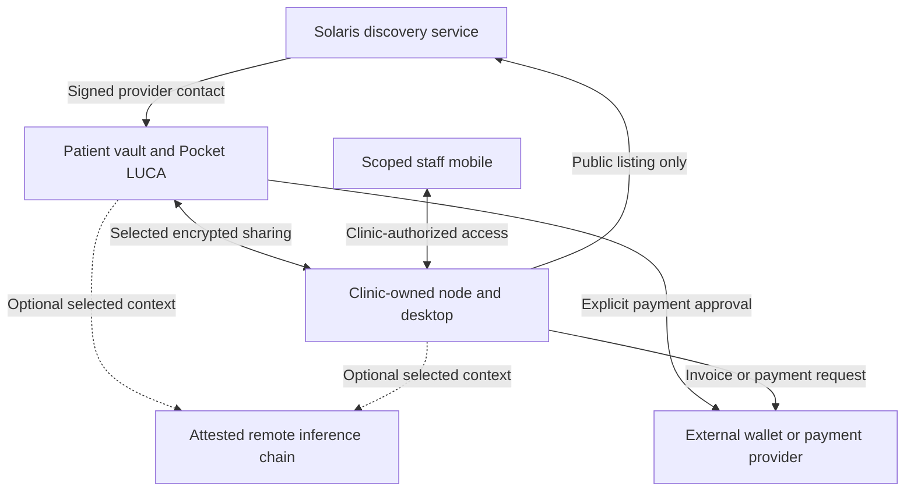

# Solaris sovereign architecture and Copilot roadmap

Revision 2 • 16 September 2026 • Incorporates Majd's pasted GitHub Copilot readiness assessment and a targeted current-source recheck

Status: architecture and implementation handoff only. No code, deployed controls, legal approval, tests or release gates were completed by revising this document. This revision supersedes the previous version of this same handoff.

## 0. How to use this revised handoff

Attach this complete file to GitHub Copilot and use the instruction in section 8. Begin with the evidence and release-scope work package, then implement the smallest discovery-boundary change. Do not start by buying compliance products, rebuilding the entire application, or treating the original assessment as a current test report.

Copilot's conclusion—production/patient readiness has not been demonstrated—is an appropriate working decision for the existing clinical web application. Its security concerns remain useful. However, the report assessed the existing hosted Health Passport/practitioner/wallet application, while the target architecture moves clinical processing to patient and clinic devices. Each finding therefore needs a location, owner, evidence status and release scope.

The assessment supplied by Majd does not specify its reviewed SHA, deployed SHA, scan output or test execution. Its P0/P1 labels are assessment labels, not necessarily the repository release ledger's finding IDs. Preserve both sources without silently merging or renumbering findings.

What changed in this revision:

- Added a finding-by-finding disposition for Copilot's operational, security, privacy and compliance concerns.
- Corrected broad statements about complete PHI redaction, absent backup documentation, current CI enforcement, runtime support and test-count evidence.
- Added separate release criteria for discovery, the patient vault, clinic software and optional remote inference.
- Added a ticket-ready sequence with ownership and acceptance evidence, including actual pipeline/restore verification.
- Expanded the Copilot prompt to reconcile both assessments without waiving P0 findings, publishing misleading privacy claims or changing live deployments.

## 1. Recommendation

Adopt this direction: Solaris operates discovery and coordination; patients operate private vaults; clinics operate their own records and staff permissions; optional compute and payment providers have explicit, limited roles.

This is a better long-term fit for Majd’s identity-first, local-first vision than expanding Solaris into a centrally hosted clinical system. It reduces centralized clinical data holdings and gives clinics continuity if Solaris is unavailable. It is not automatically easier to operate: device recovery, clinic backups, staff access, software updates, and asynchronous messaging become critical product responsibilities.

The central design requirement should be: **Solaris-operated discovery infrastructure cannot decrypt patient records or private conversations, and does not receive clinical plaintext in its AI, logging, support, or analytics paths.** This is a target to demonstrate, not a current claim.

Avoid the absolute statement “health data never leaves the device.” Sharing with a practitioner creates a recipient copy; remote inference processes selected data outside the device. A more accurate target statement is: “Your vault is stored on your device. You choose which information to share with a clinic or optional remote AI service. The discovery service is designed not to receive your medical records.” Publish only after verifying the relevant implementation.

The recommended first commercial product is a directory plus private care inbox, followed by a small clinic workspace. A comprehensive replacement for existing clinical record software can follow demonstrated demand and regulatory scoping.

## 2. Evidence and what remains unverified

### Current repository

The targeted read-only recheck for revision 2 confirmed `TheMajicCode/solaris-health` default `main` at `09d6e6a43e751d31d06080e45364113a69759b1b`. This is a dated source snapshot, not proof of either live Abacus deployment. Earlier branch-head observations below are carried forward as dated evidence, not newly verified deployment mappings.

| Source evidence | Why it matters for this proposal |
|---|---|
| Backend schema includes patient, treatment, vault, and conversation records | Existing backend is broader than a directory |
| `backend/src/routes/luca.js` writes user/assistant content to `luca_messages` and assembles personal and health context | Existing cloud LUCA path conflicts with the intended clinical boundary |
| `backend/src/routes/journal.js` writes journal content; `health-documents.js` stores descriptions/summaries | Removing only document uploads would be insufficient |
| `backend/src/routes/messages.js` persists encrypted messages/attachments and participant/booking/read metadata | E2EE cloud messaging storage is not evidence of direct P2P architecture |
| `docs/beta-v1/README.md` contains a no-P0-waiver release policy and excludes Clinic OS from that beta | A new roadmap cannot silently override release controls or claim the clinic product already exists |

The current source may contain security improvements absent from older audit ledgers. Do not repeat historical key-storage or identity-binding findings as unresolved without checking the exact current file. Conversely, new product language does not establish that legacy clinical flows are disabled.

The repository’s `AGENTS.md` names a working branch. The review found `agent/abacus-beta-v1-hardening` at `f7768043262c534fc974192fece56890560bc6e4`, and the preview-named `agent/solaris-preview-v3-navigation-ui-fixes` at `79f10b23b9cc5d0bc61cae4b4e6608d918ec0207`. Names do not prove deployment. Copilot must reconcile repository instructions, intended base branch, and actual Abacus deployment before changing code.

Current-source links:

- [LUCA route](https://github.com/TheMajicCode/solaris-health/blob/09d6e6a43e751d31d06080e45364113a69759b1b/backend/src/routes/luca.js)
- [Journal route](https://github.com/TheMajicCode/solaris-health/blob/09d6e6a43e751d31d06080e45364113a69759b1b/backend/src/routes/journal.js)
- [Health documents](https://github.com/TheMajicCode/solaris-health/blob/09d6e6a43e751d31d06080e45364113a69759b1b/backend/src/routes/health-documents.js)
- [Messages](https://github.com/TheMajicCode/solaris-health/blob/09d6e6a43e751d31d06080e45364113a69759b1b/backend/src/routes/messages.js)
- [Beta policy](https://github.com/TheMajicCode/solaris-health/blob/09d6e6a43e751d31d06080e45364113a69759b1b/docs/beta-v1/README.md)
- [Repository agent instructions](https://github.com/TheMajicCode/solaris-health/blob/09d6e6a43e751d31d06080e45364113a69759b1b/AGENTS.md)

No production database, network capture, deployed process, mobile source tree, signed build, or live Maple attestation was verified in this assessment. The latest user report describes Pocket LUCA chat failing even on “hello”; a separate successful test button does not establish functioning conversational inference. Preserve the newest accepted APK/source/signing lineage and reconcile its exact build manifest before mobile work. Do not restart from an older V5 or recovered V6 tree based on memory.

### 2.1 Copilot assessment: corrections and evidence limits

The useful existing foundation—React/Vite UI, Express/PostgreSQL backend, AI adapters, parameterized queries, security middleware, health/readiness endpoints and test infrastructure—should be retained where it fits the new deployment role. Code patterns and README assertions do not establish current operational readiness.

| Assessment topic or implication (paraphrased) | Revised interpretation | Evidence or next verification |
|---|---|---|
| Not yet safe for real patient/production use | Keep clinical release blocked under existing governance; do not translate a lack of demonstrated readiness into proof that every reported vulnerability is present in production | Reconcile ledger, current source, candidate build and actual deployed configuration |
| PHI redaction before any external model call | Too broad. Redacting submitted message text does not establish that separately assembled history/context, tool output or provider error bodies are safe | Current `luca.js` separately passes context to the AI adapter. Discovery must not use this clinical path; retained clinical paths need full-flow authorization/minimization tests |
| Scope of the identifier-redaction layer | It is a narrow identifier-pattern filter, not de-identification | The inspected patterns cover SSN-like, card-like and IBAN strings; its comments allow health context under member-own-query consent. Do not describe this as removal of names, health facts or all personal information |
| No automated backups/recovery procedure documented | Documentation exists. Its statements are not proof of an operating backup or successful restore | `docs/INCIDENT_RESPONSE.md` describes a cron/S3 backup arrangement and restore procedure; it also has operational placeholders. Require actual job configuration, sanitized success evidence and an isolated restore drill |
| CI/SCA must be enforced | Valid requirement; current source does not demonstrate enforcement | Recursive main-tree inspection found templates under `ci-workflows/`, no `.github/workflows/` entries and no Dependabot configuration. Platform-managed security settings and external Abacus CI were not inspected |
| CI applies migrations and runs lint | Presence of a command is insufficient | `ci-workflows/ci.yml` has migration/lint paths that suppress failures. These must not become production acceptance gates unchanged. `backup.yml` is a template rather than proof of actual backup execution |
| ~133 tests and high coverage | Historical/reporting claims only; no tests were run in this revision | Capture exact candidate SHA, runtime, install method, commands, exit codes, test counts, skipped suites and generated coverage |
| Node >=20 recommended | An open-ended lower bound is not a production support policy. Node 20 is now EOL | Select a currently supported, dependency-compatible LTS baseline and prove it in CI and the actual deployment. Node 22/24 are listed as LTS at this review date; do not upgrade blindly. [Official Node release status](https://nodejs.org/en/about/previous-releases) |
| Runtime alignment and rate-limit persistence | Source shows configuration differences that need explicit reconciliation | Both Dockerfiles use Node 22; the CI template uses Node 20; package files do not declare engines. Authentication limits default to PostgreSQL outside tests but permit a memory override, while global limiting is per-process memory |
| Recommendation to move secrets into managed storage | The problem is secret provenance, access, leakage, rotation and auditability—not the mere use of runtime environment injection | A hosting platform's protected secret store may be sufficient if its controls are demonstrated. Inspect configuration without exposing secret values |
| Handling PHI means HIPAA and BAAs with cloud providers | Conditional on US HIPAA roles and relationships; other regions have different duties and contracts | Do not label every health-data flow HIPAA-covered. Where a service acts for a covered entity, lack of decryption keys does not by itself remove business-associate status. [HHS guidance](https://www.hhs.gov/hipaa/for-professionals/special-topics/health-information-technology/cloud-computing/index.html) |
| 2–4 weeks for demo; months for PHI | Copilot's rough estimates, not a Solaris delivery commitment | Estimate only after deployment access, inventory, release scope, unresolved defects and legal obligations are known |

Evidence links for this recheck: [CI template](https://github.com/TheMajicCode/solaris-health/blob/09d6e6a43e751d31d06080e45364113a69759b1b/ci-workflows/ci.yml), [backup template](https://github.com/TheMajicCode/solaris-health/blob/09d6e6a43e751d31d06080e45364113a69759b1b/ci-workflows/backup.yml), [incident/restore documentation](https://github.com/TheMajicCode/solaris-health/blob/09d6e6a43e751d31d06080e45364113a69759b1b/docs/INCIDENT_RESPONSE.md), [server composition](https://github.com/TheMajicCode/solaris-health/blob/09d6e6a43e751d31d06080e45364113a69759b1b/backend/src/server.js).

Further source references: [identifier filter](https://github.com/TheMajicCode/solaris-health/blob/09d6e6a43e751d31d06080e45364113a69759b1b/backend/src/lib/phi-boundary.js), [AI adapter](https://github.com/TheMajicCode/solaris-health/blob/09d6e6a43e751d31d06080e45364113a69759b1b/backend/src/lib/ai/index.js), [rate-limit configuration](https://github.com/TheMajicCode/solaris-health/blob/09d6e6a43e751d31d06080e45364113a69759b1b/backend/src/lib/rate-limits.js), [backend Dockerfile](https://github.com/TheMajicCode/solaris-health/blob/09d6e6a43e751d31d06080e45364113a69759b1b/Dockerfile.backend), [frontend Dockerfile](https://github.com/TheMajicCode/solaris-health/blob/09d6e6a43e751d31d06080e45364113a69759b1b/Dockerfile.frontend), [root package](https://github.com/TheMajicCode/solaris-health/blob/09d6e6a43e751d31d06080e45364113a69759b1b/package.json), [backend package](https://github.com/TheMajicCode/solaris-health/blob/09d6e6a43e751d31d06080e45364113a69759b1b/backend/package.json).

The branch response also reported `protected:false` and required-status-check enforcement off. This is not an inspection of every organization ruleset or external deployment policy. Record the actual protection/enforcement arrangement before claiming CI is a required gate; do not change repository permissions or protection settings incidentally in a coding task.

### 2.2 Finding disposition and acceptance evidence

The CP identifiers below are reconciliation IDs for this handoff, not replacements for repository P0/P1 IDs. “Move” means the control remains necessary in a new location; it does not mean Solaris can transfer all software-provider duties to a clinic by contract. No row is marked resolved by this document.

| ID / Copilot topic | Disposition under the proposed architecture | Required acceptance evidence |
|---|---|---|
| CP-01 Governance / no P0 waiver | Retain existing release policy. Propose explicit product scopes through the authorized decision process | Current ledger mapped to each product; exact evidence for fixed items or exclusions. A discovery-only exception cannot be self-declared by an agent |
| CP-02 Compliance, contracts, breach response | Scope by entity, jurisdiction, data flow and actual service. Clinic records remain regulated locally; discovery still processes personal metadata | Role/data-flow matrix, applicable notices and agreements, privacy ownership, incident responsibilities and a tested response exercise; qualified review for unresolved legal classifications |
| CP-03 Secrets and JWT management | Retain cloud application secrets; move vault/clinic keys to their owners' devices. Keep wallet keys with the wallet | Production startup rejects missing/default secrets; protected runtime injection, least privilege, rotation and session invalidation demonstrated; no secret values in logs/evidence |
| CP-04 Backups and disaster recovery | Retain discovery/account backups; add separate patient-vault and clinic-node recovery | Actual encrypted backups, retention, monitored failures and clean-machine restore. Define RPO (acceptable data loss) and RTO (recovery time); demonstrate chosen targets. Use PITR where the database/recovery target requires it, not as a generic label for every local file |
| CP-05 Audit logs and retention | Keep minimal cloud administrative/security events; detailed clinical access/change events stay with the clinic | Actor, action, time and outcome with access control, retention and integrity protection. Select tamper-evident/immutable storage proportionately. Do not centralize clinical payloads to satisfy an audit checklist or publish health hashes as proof |
| CP-06 Monitoring, alerts and runbooks | Retain for public discovery; provide local node health/backup/update status for clinics | A named operational owner, defined service objectives and a controlled test that reaches the intended alert destination; sanitized metrics with no patient, conversation or diagnosis labels. Prometheus output alone is not alerting |
| CP-07 Dependency/vulnerability management | Retain across web, node, mobile, native libraries and model runtimes | Lockfile-based inventory/SBOM, actual scan output, enforced policy, patch ownership and urgent response procedure. Fix exploitable release-blocking findings; no blanket ignore/continue-on-error. Any exception must be specifically authorized, dated and compatible with the no-P0-waiver policy |
| CP-08 TLS, HSTS and ingress | Retain for public web/API; authenticate/encrypt relevant node links | Verify the actual serving origin/ingress, certificate renewal, HTTP handling, HSTS scope and proxy trust. Risk-assess WAF needs; WAF is not a substitute for authorization or a universal legal requirement |
| CP-09 Data flow, PHI redaction and DLP | Replace cloud clinical ingestion with an enforceable discovery boundary; retain minimization and egress controls for clinical endpoints | Trace plaintext, ciphertext, metadata and derivatives through API, DB, logs, tools and vendors. Synthetic canary tests include error paths. Regex redaction and a DLP purchase cannot establish anonymity or make prohibited ingestion acceptable |
| CP-10 CI/CD and migrations | Retain with separate deployment roles and least-privileged jobs | Real workflow/config and successful runs on the exact candidate. Fail on relevant errors; no privileged secrets in untrusted jobs. Serialize migrations; use transactions where supported and recovery/compatibility plans elsewhere. Readiness must block incompatible versions |
| CP-11 Build artifacts, images and demo credentials | Retain for every distributable artifact | Review build contexts/layers, public frontend configuration, source maps and secret scans. Runtime-only secrets; example values never accepted in production. Do not reuse the assessment's illustrative database password |
| CP-12 CSP and browser hardening | Retain; source confirms Express CSP disabled, but deployed frontend policy is unverified | Inspect headers on the origin that actually serves HTML. Test the real discovery UI and contact flow under CSP; use report-only during tuning, then enforce the reviewed policy. Sanitize CSP reports; add SRI where applicable to external static scripts rather than indiscriminately to bundled modules |
| CP-13 Structured logging/traces | Retain bounded operational logs; prohibit clinical content on discovery paths | Test request bodies, URLs, headers, provider errors, exceptions, breadcrumbs and support bundles. Correlation IDs must not encode patient identities; exclude prompts/answers and secrets from third-party logs |
| CP-14 Rate limiting and scaling | Retain abuse controls; choose storage to match measured deployment | Verify trusted proxy/IP behavior, multi-instance consistency if deployed that way, store outages and bypass attempts. Do not add Redis/sharding solely because it appears in an audit checklist |
| CP-15 Runtime, locks and tooling consistency | Retain reproducible builds and supported runtimes | Declare/test supported engine/package-manager versions; align CI/container/Abacus runtime and actual locks. Reconcile lint configs and avoid unrelated framework upgrades |
| CP-16 AI contracts, models and execution evidence | Localize private context; assess optional Maple separately | Selected provider/model/version metadata where available, context authorization, prompt-free local receipts, protected credentials, attestation policy and no silent fallback. A claimed model name or local URL is not proof of execution location |
| CP-17 Maintainability / large server | Refactor only enough to enforce and test role separation first | Small tested route-composition/config changes. Avoid a broad rewrite before the deployment boundary is established |
| CP-18 Independent security review | Retain proportionate independent review before clinical rollout | Assess actual app, node, recovery/permissions, inference path and relevant infrastructure; track remediation and retest. An external review does not certify every future build or replace applicable legal duties |

Unknown is an evidence status, not a pass. For each claimed missing operational control, request the smallest relevant artifact—configuration reference, sanitized job result, restore record or deployment mapping—rather than concluding that absence from a repository proves absence in the hosting platform.

Boundary tests have two distinct cases. In the supported patient-to-clinic journey, synthetic clinical markers must never be sent to discovery infrastructure. In adversarial tests that deliberately submit a prohibited payload to a public endpoint, the acceptance condition is rejection without persistence, logging, queueing, inference or other downstream effects. A public server cannot guarantee that nobody ever sends it unsolicited sensitive bytes. Privacy claims must describe the designed processing boundary accurately rather than promise control over arbitrary incoming traffic.

### Previous roadmap comparison

| Earlier emphasis | Proposed direction | Judgment |
|---|---|---|
| Abacus cloud as rapid all-in-one prototype | Abacus hosts a deliberately limited directory and administrative services | Appropriate evolution; reuse UI and discovery work |
| Hosted health dashboards, messages, bookings, LUCA memory | Patient and clinic nodes hold clinical content | Stronger fit with ownership; requires real separation |
| Practitioner web portal is primary workspace | Web manages public listing; local desktop manages private work; mobile receives scoped clinic access | Clear responsibility split |
| Server-side Maple proxy | Clinic-local proxy or validated native client encryption | Necessary change for the new no-plaintext-on-Solaris goal |
| Rich agent/wallet/GPS expansion | Private sharing and reliable node operations first; narrow adapters later | More achievable and easier to verify |

Preserve earlier principles: Solaris ID is above particular keys; an npub is a linked credential, not the whole identity. GPS is the policy/allocation/settlement/receipt protocol, not geolocation. Public Nostr activity must not become the clinical record layer.

## 3. Target system



Edges identify intended data relationships. Remote inference is a separate processing boundary. Encryption, metadata exposure, provider contracts, and downstream model services must be evaluated for the complete route.

### Solaris discovery service

Store public practitioner/venue/service descriptions, separately verified professional credentials, signed contact descriptors, public opening hours, general availability, directory administration, and minimal service-account/billing records. Enable account-free browsing where practical. Let the phone filter downloaded public listings when feasible.

Do not accept symptoms, patient intake, clinical attachments, medical journals, treatment plans, health embeddings, patient AI conversation memory, private keys, or appointment reasons. Avoid unrestricted inquiry forms that invite patients to disclose medical details. Public reviews can also disclose health information; defer them or use a deliberately narrow, moderated design.

Treat search terms, IP addresses, account activity, provider contacts, and payment references as potentially identifying and sometimes sensitive. A URL or analytics event such as an identified user visiting a particular specialty can reveal health interests. Minimize access logs, query logging, tracking pixels, session replay, and third-party scripts. Define retention for security metadata rather than claiming the service holds no personal data.

Public scheduling can expose generic slots; the named appointment and reason belong to the clinic node. Even an opaque centrally stored booking token can reveal associations when linked to a user and clinic. Do not call it anonymous without evidence.

Keep Abacus administrative AI limited to public/nonclinical information. If Solaris sponsors external inference credits, a separate entitlement service should handle billing without receiving prompts. Do not invent a privacy-preserving token mechanism until the provider supports and validates it.

### Patient vault

Store encrypted records, local search/indexes, habits, selected health metrics, conversations, sharing receipts, and local LUCA context. Keep encryption keys in appropriate operating-system-backed storage, with a recovery/export design that does not require Solaris to possess the decryption secret.

Use several keys for separate jobs: durable identity binding, device authorization, conversation encryption, and wallet signing. A lost phone must be recoverable without an administrator silently impersonating the patient. A key rotation must not erase identity or misdirect existing conversations.

For each share, show recipient identity and organization, actual selected material, purpose, and whether a downloadable recipient copy will be created. Expiring links/capabilities limit future access; they cannot retract screenshots, exports, previously decrypted copies, or legally retained clinic records.

A private vault remains usable when discovery, AI, wallet, or transport adapters are unavailable. Removing an adapter must not remove the patient’s data.

### Clinic node plus desktop interface

“Clinic OS” should initially mean a small clinic-operated software system, not a new operating system. Run one background node service with an encrypted local database and attachment store, staff authorization, message queues, audit events, backup/export, and an optional AI worker. A desktop UI connects to that service. The node keeps working when the window closes; it cannot receive messages when its hardware is powered off or disconnected.

Begin with one clinic node as the authoritative writer for accepted clinical records. Use draft/version workflows for staff edits rather than attempting unrestricted multi-master clinical-record merging. Patient-held records and clinician-authored records have different provenance and correction rules.

Package a supported installer with a clear startup/status screen, signed updates, pinned dependencies, and recoverable migrations. Do not require the clinic owner to operate Docker or a terminal. Internally, implementation can use whichever supported runtime is best supported by the existing project and a measured spike.

Start with one supported desktop OS and hardware profile. “Clinic chooses its hardware” means clinic ownership and documented compatibility; it cannot mean every device runs every QVAC model. Core messaging and records must work without a large model or GPU. Model download, memory checks, context limits, and performance tests belong in an optional setup step. A supported acceleration upgrade can follow measured demand.

Require automatic encrypted backups to clinic-chosen storage, tested restore on a replacement machine, recovery-key custody, and a plan for disk loss, theft, power failure, and staff departure. The clinic controls the record and backup policy. If Solaris later sells managed backups, remote administration, recovery escrow, or hosting, reclassify that service’s responsibilities.

### Staff companion

Reuse a shared mobile foundation if practical, with a distinct clinic workspace and authorization context. Never share the clinic owner’s private key across staff devices.

| Role | Example permission |
|---|---|
| Clinic administrator | Enroll/revoke devices, assign roles, manage node and backup settings |
| Treating practitioner | Read/write assigned clinical records and patient conversations |
| Reception | Scheduling and designated intake conversations; no default whole-chart access |
| Assistant | Assigned tasks and explicitly selected material |
| AI worker | Minimal task context and narrowly allowed tools; no independent admin or wallet rights |

The node enforces permissions; hiding screens is insufficient. Administrative ownership does not itself authorize unrestricted viewing of every clinical record; clinical access must have an appropriate role and purpose. Enrollment binds a named worker and a device to scoped, expiring credentials. Grants include clinic, patient/case or conversation scope, permitted operations, issuer, expiry, and revocation state. Fetch only authorized records; do not synchronize the full encrypted clinic archive to every employee and rely solely on UI filters.

A revoked offline device may retain previously received information. Use limited caches, short access leases where appropriate, key rotation for future traffic, and organizational procedures. Remote deletion is best-effort, not a guarantee.

### Message transport and identity

Use a transport adapter; investigate Holepunch/Bare/Pear with an actual Android-to-desktop encrypted message exchange before committing to a rewrite. Direct P2P still needs discovery, NAT traversal, connectivity infrastructure, delivery receipts, duplicate/replay handling, and an offline delivery policy. It is not inherently anonymous.

Prefer clinic-operated inbox availability initially. If both parties are offline, show “queued,” not “delivered.” For reliable asynchronous delivery, add an explicit encrypted mailbox option with stated operator, ciphertext retention, metadata exposure, and legal role. Solaris running that mailbox expands its service scope even without keys. Mobile push should carry a generic wake-up signal, never message text, diagnoses, or unnecessary clinic/patient identifiers.

A signed provider descriptor can bind the clinic identity to its contact keys, supported transports, issuer, expiry, and key-rotation evidence. A cryptographic signature demonstrates key control; professional licensing needs independent verification. Protect against directory key substitution using pinned contacts, rotation warnings, and out-of-band fingerprint checks for first sensitive exchange. Use private/pairwise patient contact identifiers where the chosen protocol supports them; avoid publishing the care relationship graph.

Current Pear documentation includes a Bare-based shared core and mobile hosting through native/React Native components; describing Pear as exclusively desktop is now too broad. Its suitability must still be demonstrated in Solaris's mobile lifecycle. QVAC documents local inference capabilities, but it supplies neither clinic permissions nor proof of clinical fitness. [Pear runtime](https://docs.pears.com/pear/explanation/runtime-and-languages/), [QVAC](https://github.com/tetherto/qvac).

Learn from Buzz's signed-event, permission and agent patterns, but do not treat it as proven P2P clinical messaging. Its documented relay is authoritative, and Block's hosted-service disclosure says messages, DMs and uploads are not E2EE. [Buzz architecture](https://github.com/block/buzz/blob/main/ARCHITECTURE.md), [Buzz service disclosure](https://block.github.io/buzz/support.html).

## 4. LUCA and Maple

Keep one LUCA identity/experience with multiple deliberately selected compute locations, not a central super-agent with access to all vaults.

| Mode | Intended use | Data boundary |
|---|---|---|
| Phone-local | Simple assistance, navigation, local retrieval, bounded habits/tasks | Phone only |
| Clinic-local QVAC | Clinic search and draft assistance using authorized records | Clinic node and authorized endpoints |
| Optional Maple-backed remote compute | Larger reasoning over a deliberately selected context package | Data leaves device/clinic for a separately assessed confidential-compute chain |

Model size does not establish medical competence. First prove reliability on actual chat, cancellation, restart, download verification, model loading, and constrained-memory behavior. Offer deterministic navigation/actions alongside model generation. If a model cannot reliably answer a basic greeting, changing only the text entry UI does not fix its integration; suggested prompts still require testing through the same inference path.

For remote requests, assemble context locally. Show the selected documents/snippets and provider before the first sensitive transfer; remember only clearly scoped, revocable preferences. Do not upload the full vault, a persistent health embedding database, or complete clinic context by default. If confidential inference is unavailable or verification fails, show failure/local alternatives; do not silently send the same material to a conventional cloud provider.

The current Maple proxy accepts standard API requests locally and performs its confidential session handling afterward. Therefore a proxy on Abacus creates a plaintext boundary on Abacus. A clinic-local proxy is the documented practical desktop approach. Native phone integration needs a focused SDK/runtime/attestation spike; it is not an already demonstrated feature of the Solaris APK. [Proxy](https://github.com/MaplePrivacyLabs/Maple/tree/master/proxy), [SDK](https://github.com/MaplePrivacyLabs/Maple/blob/master/sdk/README.md).

Maple is not an installer that makes an arbitrary “supercomputer” confidential. Hosting inference on Solaris infrastructure would require a supported confidential-compute deployment, hardware-backed attestation, verified release measurements, restricted administration, and verification of any downstream inference provider. This review has not established that Abacus provides that configuration. Prefer the existing supported provider path for a bounded experiment. Maple's own backend documentation distinguishes source/build evidence from evidence about production measurements, access control and networking. [Maple backend](https://github.com/MaplePrivacyLabs/Maple/blob/master/services/opensecret/README.md).

The complete route matters: client encryption, authentication, attestation policy, enclave service, model/GPU provider, streaming output, logs, session state, caching, retention, and tool/search egress. An encrypted front door is insufficient evidence for every downstream step. Attestation establishes claims about a measured environment, not the safety of its model output or the absence of vulnerabilities. Do not use a proof-page screenshot as successful live verification. Maple documents downstream provider integration, which is a reason to inspect the complete chain. [Provider integration runbook](https://github.com/MaplePrivacyLabs/Maple/blob/master/services/opensecret/docs/local-macos-stack.md).

Maple's April 7, 2026 privacy notice describes API metadata collection and an API developer/controller–Maple/processor relationship. That contractual language is not a final legal classification of Solaris, but it confirms that encryption does not mean no processing responsibilities. [Maple privacy notice](https://www.trymaple.ai/privacy).

Begin clinic testing with a clinic-owned provider account/key stored locally. Bind the local proxy to loopback, restrict callers with appropriate authentication/request-origin controls, and disable sensitive request logging; do not expose its plaintext API publicly or indiscriminately across the clinic LAN. Never compile a shared Solaris master API key into an APK or expose it to the browser. Native per-user credentials or provider-supported limited tokens are future options to validate. For managed billing, verify that authorization can be separated from plaintext inference without inventing undocumented Maple capabilities.

Agents can propose actions. A deterministic executor on the patient/clinic node checks permissions, recipients, scope, and any necessary human approval before sharing, writing a record, or paying. Retrieved records and incoming messages are untrusted inputs, not authority to change tool permissions. Require clinician review of clinical drafts and explicit user authorization for new disclosures and spending.

## 5. Compliance scope: establish roles before buying certifications

This is an engineering/legal scoping assessment, not a legal opinion that Solaris is exempt. Exact duties depend on the Solaris legal entity, places of business, launch markets, contracts, actual processing, and product claims. An El Salvador clinic and a founder operating from Quebec can create more than one relevant jurisdiction.

There is no universal “health app compliance certificate.” Treat privacy laws, clinic professional duties, medical-device rules, payment regulation, contracts, and voluntary security assurance as separate questions.

| Regime | Trigger and practical consequence for this proposal |
|---|---|
| Canada — PIPEDA | Commercial personal-information processing can include accounts, support, identity bindings and metadata. Provincial allocation matters; interprovincial/international commercial flows remain relevant. Establish accountability, purposes/consent, minimization, safeguards, rights, retention and incident handling. [OPC scope](https://www.priv.gc.ca/en/privacy-topics/privacy-laws-in-canada/the-personal-information-protection-and-electronic-documents-act-pipeda/pipeda_brief/), [federal/provincial allocation](https://www.priv.gc.ca/en/privacy-topics/privacy-laws-in-canada/02_05_d_15/). |
| Quebec — private-sector law / Law 25 | If the enterprise has the relevant Quebec nexus, assess its personal-information activities, required privacy impact assessments, privacy responsibility and foreign disclosures/provider agreements. The marketplace can be in scope without a clinical database. [CAI Law 25 changes](https://www.cai.gouv.qc.ca/protection-renseignements-personnels/sujets-et-domaines-dinteret/principaux-changements-loi-25). |
| Quebec — health and social services information law (LRSSS) | In force since July 1, 2024 for covered organizations; relevant private practices require their own health-information analysis. Do not treat Law 25 as the only Quebec clinic regime. [Quebec health information guidance](https://www.quebec.ca/sante/vos-informations-de-sante/renseignements-sante-services-sociaux-professionnels), [medical regulator guidance](https://www.cmq.org/fr/pratiquer-la-medecine/informations-clinique/dossiers-medicaux/tenue-registre-journalisation). |
| Ontario — PHIPA | Clinics can remain health information custodians with locally stored records. Solaris's actual services may create electronic-service-provider or agent duties. Locally installed software does not by itself establish a vendor exemption. [Ontario IPC health-sector AI guidance](https://www.ipc.on.ca/fr/media/4999/download?attachment=). |
| El Salvador — LPDP, Decree 144 | Current comprehensive personal-data law includes sensitive health information and controller/processor duties. Article 15 addresses designation of a data-protection delegate. Aura's records and Solaris's distinct processing require separate scoping, rights/security procedures and transfer review. ACE lists the law and implementation instruments as active; this review did not verify detailed filing mechanics or deadlines. [Enacted law](https://ace.gob.sv/page/documentos/decretos/decreto_144_proteccion_datos.pdf), [ACE instruments](https://ace.gob.sv/page/politicas). |
| US — HIPAA, conditional | A patient-selected consumer app is not automatically a business associate. Acting for a covered clinic can change the role. HHS states that no-key encrypted cloud processing/storage does not by itself avoid business-associate status. Assess the actual clinic, relay and inference arrangements and required BAAs before that service. [HHS app scenarios](https://www.hhs.gov/sites/default/files/ocr-health-app-developer-scenarios-2-2016.pdf), [HHS cloud guidance](https://www.hhs.gov/hipaa/for-professionals/special-topics/health-information-technology/cloud-computing/index.html). |
| US — FTC/state health privacy, conditional | HIPAA does not cover every consumer health app. Qualifying personal-health-record services can fall under the FTC Health Breach Notification Rule, and state laws can cover health data/inferences. Review before US targeting, particularly when adding wearable or multi-source imports. [FTC rule guide](https://www.ftc.gov/business-guidance/blog/2024/04/updated-ftc-health-breach-notification-rule-puts-new-provisions-place-protect-users-health-apps), [Washington state example](https://www.atg.wa.gov/protecting-washingtonians-personal-health-data-and-privacy). |
| EU — GDPR, conditional | EU establishment or qualifying targeting/monitoring can create scope; merely having a globally accessible website is not the whole test. Assess roles, lawful basis plus health-data condition where relevant, processor contracts, rights, transfers and DPIA duties. Pseudonymous identifiers are not automatically anonymous. [GDPR](https://eur-lex.europa.eu/eli/reg/2016/679/oj/eng). |
| Medical-device software | Intended purpose, function and claims determine scope; local hosting and open source are not exemptions. Discovery, communications and administrative support differ from diagnosis, treatment selection and clinical risk prediction. Assess each AI function. [Health Canada SaMD guidance](https://www.canada.ca/en/health-canada/services/drugs-health-products/medical-devices/application-information/guidance-documents/software-medical-device-guidance-document.html), [FDA CDS guidance, January 29, 2026](https://www.fda.gov/regulatory-information/search-fda-guidance-documents/clinical-decision-support-software), [FDA general wellness guidance](https://www.fda.gov/regulatory-information/search-fda-guidance-documents/general-wellness-policy-low-risk-devices). |

These rows identify relevant regimes and likely triggers, not a determination that all apply at once. Limit initial service geography and functions explicitly, then assess expansion. Neither a patient's consent nor a clinic's contract can waive statutory duties.

### A practical initial compliance package

1. Document legal entities, launch geography, and roles by feature: directory, app software, clinic service, optional relay, remote inference, payments, support.
2. Maintain a data-flow register covering plaintext, ciphertext, metadata, keys, embeddings, caches, backups, push, crash reports, analytics, support, and update services.
3. Assign privacy/security ownership; complete the applicable privacy impact assessment and threat model; define access, retention/deletion, incident response, and complaint processes for the data Solaris actually handles.
4. Publish accurate privacy and service notices; separate public listing terms, patient sharing instructions, clinic operational duties, inference disclosures, and provider agreements where relevant.
5. Determine required processor/service-provider agreements and any BAA before a covered integration. Inspect vendor terms, subprocessors, locations, retention, support access, and incident obligations.
6. Record the intended use of every AI feature. Keep the initial release to discovery, communication, administration, user-directed record organization, and bounded wellness support. Clinical risk scoring, diagnosis, treatment selection, and imaging interpretation require separate assessment and validation.
7. Document clinic record retention, authorized staff access, professional licensing, continuity and backup ownership, and the distinction between patient requests and the clinic’s lawful retention duties.
8. Verify platform distribution/privacy declarations and accessibility/consumer obligations for the actual release markets. Add minors/guardian workflows only after an explicit design and legal review; initially scope the pilot to consenting adults.

SOC 2 reports, ISO 27001 certification, external penetration tests, and HIPAA training can be useful assurance activities or contractual demands; they are not interchangeable with legal compliance and none is a universal first-launch permit. HHS specifically says the HIPAA Security Rule does not require generic certification. [HHS certification FAQ](https://www.hhs.gov/hipaa/for-professionals/faq/are-we-required-to-certify-our-organizations-compliance-with-the-standards/index.html). FHIR is an interoperability standard, not proof of privacy compliance. A disclaimer cannot convert a diagnostic function into an unregulated wellness function.

Payments should initially be clinic invoices or payment requests fulfilled by external wallets/providers. No Solaris custody of funds, seeds, or unrestricted spending credentials. A provider handling settlement does not automatically exempt Solaris if Solaris also performs regulated transfer/exchange/payment functions. Do not deploy automatic 90/10 settlement, escrow, exchange, or reward payouts until the actual flow has been classified. [FINTRAC](https://fintrac-canafe.canada.ca/msb-esm/msb-eng), [Bank of Canada registration criteria](https://www.bankofcanada.ca/2026/06/criteria-for-registering-payment-service-providers/).

Keep GPS allocation policy distinct from payment execution. Use local/private receipts and minimal payment references; a public on-chain or Nostr receipt must not expose a patient, health service, or a linkable hash of sensitive records. Defer public health-linked reputation and automated financial agents.

## 6. Roadmap with evidence gates

These are dependency-ordered milestones, not calendar promises. Work can overlap on documentation, the directory boundary, and a disposable native transport/SDK spike. Integrate only after each gate passes.

| Phase | Deliverable | Exit evidence |
|---|---|---|
| 0 — Baseline and decision | Architecture decision record, legal role/data-flow matrix, current branch/commit/deployment inventory, preserved Android baseline | Current evidence separated from old reports; no invented passing tests or signing lineage |
| 1 — Discovery boundary | Dedicated discovery deployment/profile and database role; private features absent from its API and frontend | Clinical endpoints unavailable server-side; negative tests for uploads, journals, chat prompts, hidden routes, and logs; separate directory release review |
| 2 — Private care inbox | One patient app, one clinic node, one practitioner; verified keys and encrypted selected sharing | Works across separate networks; queued/sent/delivered/read states truthful; offline restart and duplicate handling proven |
| 3 — Clinic workspace | Desktop inbox, selected case record, generic scheduling, small staff companion, audit and backup UI | Role enforcement tested at node; lost device/revocation behavior demonstrated; restore to replacement hardware succeeds |
| 4 — Useful local LUCA | Reliable phone integration plus optional clinic-local QVAC worker | Measured latency/memory and failure behavior on supported hardware; source/provenance of answers; clinical drafts reviewed |
| 5 — Optional confidential inference | Local client/proxy path, validated mobile spike, provider agreements, selected-context UX | End-to-end request trace and deployed attestation policy; no clinical plaintext on Solaris/Abacus discovery or routing infrastructure; plaintext limited to authorized endpoints and assessed attested processing; downstream model/tool egress assessed; bounded credentials; fail-closed behavior |
| 6 — Payments and GPS adapters | External invoice/payment flow and minimal private receipts; scoped allocation policy | Recipient/amount approval, no master wallet keys, regulatory role documented, no health leakage through public receipts |
| 7 — Aura pilot and expansion | Supported install/update/recovery playbook, clinic training and evaluated pilot | Applicable legal/clinical/security release gates passed; then consider broader Clinic OS, wearables, multi-clinic, and hardware packages |

Use synthetic records throughout initial development. A directory can have a release decision separate from a clinical product, but that separation must be enforced in code, deployment, credentials, and documentation; it is not a waiver of existing project-wide release controls.

### 6.1 Separate release decisions

All profiles below are proposed scopes. None is declared ready. A separate release assessment is valid only after the authorized governance process establishes the scope and evidence; the existing project-wide no-P0-waiver rule remains effective in the meantime.

| Release profile | Data/functions allowed | Blocking evidence before this profile is released |
|---|---|---|
| D — Public discovery | Public listings, independently verified provider claims, minimal account/security metadata and signed contact handoff | Server-side clinical exclusion; effective web security and supported runtime; real CI/security gates; secret controls; restore and operational response; applicable marketplace privacy obligations |
| V — Patient vault | Local records, local AI/context, user-selected sharing and device recovery | Encryption/key and recovery review; compatible signed updates; consent/recipient display; transport tests; no clinical leakage through telemetry, backup defaults or error reporting |
| C — Clinic node and staff companion | Clinic-local records, role-scoped conversations and optional local AI | Enforced staff/device scopes; record retention/provenance; node and patient recovery; supported install/update process; clinic operational and legal responsibilities; independent security review |
| I — Optional remote inference | Selected context to an assessed confidential processing chain | Proven client-side boundary, provider contracts/roles, credentials, attestation/downstream scope and fail-closed behavior; local results/history; separately enabled only after its gate passes |
| L — Existing hosted clinical application | Existing cloud health features, if anyone chooses to retain them during transition | Original applicable clinical/cloud controls and release gates remain; feature migration does not erase historic cloud copies or their duties |

A public “demo” can still collect real visitor information and expose a vulnerable application. Synthetic clinical data is not an exemption from web security or privacy obligations. Do not release the broad clinical backend publicly as a directory merely by changing its default screen.

### 6.2 Ticket-ready implementation sequence

These are proposed work items, not automatically created GitHub issues. Roles below are ownership assignments to make before execution, not claims that staff or legal reviewers have already accepted them. Preserve original repository P0 IDs and link the CP reconciliation IDs as additional references.

Priority definitions: **P0-R** means required before the affected production/clinical release; **P1-B** means essential to the next proposed build; **P2** means improvement after the relevant boundary is proven. These labels do not downgrade any existing P0 finding.

| Ticket / priority | Owner and dependencies | Bounded deliverable | Acceptance and evidence |
|---|---|---|---|
| SOV-00 — Baseline and findings ledger / P0-R | Implementation lead + independent reviewer; first | Reconcile current source, repository instructions, actual deployment SHA, historical ledger and CP-01–18 | Each row has source, affected product, status, owner, verification and residual risk. Unknown remains unknown; no blanket resolution |
| SOV-01 — Discovery isolation / P0-R | Web/backend implementer; SOV-00 | Allowlisted route composition, strict schemas, separate minimal data access and removal of clinical workers/AI context from this deployment | Negative tests for existing clinical routes and alternative HTTP methods; prohibited payloads rejected without DB/queue/log side effects; no dormant fallback can re-enable clinical paths |
| SOV-02 — Secrets and artifact custody / P0-R | Deployment owner; inventory from SOV-00 | Validate actual host secret injection; reject known defaults; protect build contexts/public config; document rotation | Missing/default-secret startup tests, safe rotation/session behavior, sanitized artifact scan, least-privileged runtime. Preserve independent vault/wallet keys |
| SOV-03 — Effective CI and runtime / P0-R | Build/operations owner; SOV-00 | Repair/activate the appropriate pipeline under explicit workflow-change scope; supported Node baseline; lockfile installs; tests/lint/SCA; migration policy | Actual run tied to SHA, failures propagate, relevant checks enforced. Do not copy error-swallowing templates unchanged or expose secrets to untrusted PR jobs |
| SOV-04 — Web boundary and observability / P0-R | Web/deployment owner; SOV-01/02 | Effective frontend CSP, TLS/proxy configuration, rate-limit behavior, sanitized logs and tested alerts | Browser contact flow works under enforced policy; API/header checks from real ingress; no synthetic clinical canaries in logs/traces/metrics; controlled alert reaches owner |
| SOV-05 — Recovery and incident readiness / P0-R | Deployment owner + clinic pilot operator; SOV-00 | Update existing runbook, assign owners, verify backup jobs and restore; separate future patient/clinic recovery tasks | Isolated restore meets agreed RPO/RTO; failure detected; incident exercise recorded. No live data used merely to prove a demo and no destructive test on production |
| SOV-06 — Identity and private inbox / P1-B, P0-R for V/C | Mobile/node implementer; SOV-01 and verified mobile source | Signed clinic contact → selected synthetic share → authorized reply | Cross-network and offline tests, key-change warnings, queued/delivered/accepted distinction, unauthorized recipient and replay rejection |
| SOV-07 — Clinic roles and recoverability / P0-R for C | Node/mobile implementer + clinic operator; SOV-06 | Thin staff companion, scoped grants, record provenance/audit and clinic-owned backup | Unauthorized/expired/revoked grants fail at service/replication layer; clean-machine restore for both clinic and patient; no full-clinic archive on reception phone |
| SOV-08 — Local LUCA reliability / P1-B | Mobile/inference implementer; exact Android candidate preserved | Repair actual chat path; optional larger clinic worker with model/hardware checks | Same normal path used for greeting/task tests; cancellation/restart/download/failure and memory behavior recorded; no fake success or cloud fallback |
| SOV-09 — Maple confidential path / P0-R for I | Inference implementer + privacy/security reviewer; SOV-06/08 | Clinic-local protected proxy and a separate native-mobile integration spike | Selected-context trace, actual trust policy and provider-chain evidence; no clinical plaintext through discovery/Abacus gateway; no shared API key in APK; failed verification denies request |
| SOV-10 — Legal roles and pilot release / P0-R | Majd as product owner + appropriately qualified advisers + clinic lead; starts alongside SOV-00 | Product/jurisdiction/contract matrix, intended AI uses, applicable notices/agreements and final release evidence | Explicit unresolved questions and owners; necessary approvals/contracts obtained; no assumption that patient choice waives obligations |
| SOV-11 — Payment/GPS adapter / P1-B only when scheduled | Payment/protocol implementer + relevant reviewer; private workflow proven | External payment intent and minimal private allocation/receipt records | No custody/master wallet keys; amount/recipient approval; regulatory scope recorded; no health information on public receipts |
| SOV-12 — Broader cleanup / P2 | Maintainer; after minimum boundary changes | Incremental server modularization/tooling cleanup with retained contracts | Focused regression evidence; no unrelated rewrites or major-version churn |

The first implementation package is SOV-00 followed by the bounded SOV-01 diff. SOV-02–05 are parallel preparatory work only where ownership is separate and changes do not collide. Clinical features and remote inference remain gated by their own dependencies. Do not turn this table into one giant multi-feature pull request.

Suggested evidence record for every original finding and CP item:

```text
Original finding ID and source:
Related CP and SOV IDs:
Affected product/release profile:
Source SHA, deployed SHA/config reference, review date:
Evidence status: source-confirmed | documented-unverified | deployment-verified | not established
Disposition: fix-here | implement-on-device/node | conditional-role-review | proposed-exclusion
Owner and dependency:
Reproduction or acceptance check:
Actual command/result or operational artifact reference:
Residual risk and rollback/recovery:
Reviewer and decision:
```

“Proposed exclusion” is not closure: it needs verified absence/unreachability in the release profile and a permitted governance decision. A control that moves to the clinic remains tracked there. Do not publish sensitive operational evidence or real patient data in a public issue.

### Smallest useful demonstration

An adult test patient discovers Aura’s public listing, opens a verified clinic contact in the phone app, sends a synthetic message and one selected document to the clinic node, and receives a reply. A receptionist sees only the authorized inbox; the practitioner sees the selected clinical material. The owner revokes the staff device. Restart the node, restore its backup on replacement hardware, and show the patient’s local vault still works with discovery unavailable. Separately restore the patient vault to a clean replacement device, retaining verified identity/contact bindings through the designed recovery process without Solaris possessing the decryption secret.

Inspect Solaris cloud requests/logs for that complete journey using seeded synthetic markers. Demonstrate that no message text, document, medical context, private key, or AI response reaches discovery infrastructure. Also inspect metadata rather than declaring the absence of clinical plaintext equivalent to anonymity. Repeat when adapters or deployment settings change.

### Engineering release evidence

- A release manifest ties source SHA, dependency locks, build toolchain, artifact digest, signing identity and migration version to the actual install. Preserve patient data and compatible Android signing; never solve an upgrade by asking the user to uninstall/reset their vault.
- Automated boundary tests reject prohibited payloads and prove authorization at the node, not merely UI hiding. Include third-party SDK telemetry, error paths and crash reports in synthetic leak checks.
- Test revoked and expired grants, forged/replayed messages, wrong recipients, interrupted transfers, peer/key changes, duplicated messages, and unavailable identity/inference services.
- Test disk-full, corrupted backup, lost device, migration rollback and restored-node key handling. Define measurable recovery targets with the pilot clinic.
- Threat-model signing/update compromise, an untrusted employee device, directory key substitution, stolen hardware, malicious clinical attachments and prompt injection. Use established protocols/libraries; seek independent review for the integrated cryptographic and recovery design.
- Publish separate status for directory, messaging, Clinic OS, AI modes, and wallets. A passing tiny-model heartbeat or a README test count does not validate the full clinical workflow.

## 7. Migration without losing existing work

Do not solve the new boundary by renaming the existing backend or merely hiding navigation. Create an independently deployable discovery profile/service with an allowlisted API surface, a minimal schema and credentials, and no dependency on clinical-route registration or AI context assembly.

Inventory existing data and integrations before extraction. This review does not establish that real patient data exists in the current cloud. If it does, disabling routes does not remove records from databases, backups, object storage, logs, support systems, or vendors. Plan authorized export/retention/deletion with verification; never run destructive cleanup based on an assumption.

Reuse the current branding, directory, provider cards, public service taxonomy, useful UI, and tested infrastructure. Port only bounded clinical workflows to the local clinic package, replacing cloud dependencies deliberately. Keep a compatibility layer for any necessary transition, with an explicit end date and disclosed data processing. Do not promise the target privacy boundary while legacy processing remains active in the user’s path.

Repository layout is secondary to deployment separation. Initially keep existing history and the verified Android source lineage. Introduce clearly named directory, protocol/contracts, and clinic-node packages only as justified by the existing build structure. Shared contracts can define signed provider descriptors, grants, message envelopes, sharing receipts, inference requests, and payment intents. Never put real clinical fixtures or credentials into GitHub issues, Copilot prompts, or CI artifacts.

Avoid moving Android into an unrelated branch as a permanent substitute for source organization. Once its authoritative source/signing ownership is reconciled, choose a dedicated mobile repository or workspace package based on the actual build. A new repository alone is not a security boundary.

## 8. Copy-ready GitHub Copilot instruction

```text
Use revision 2 of the attached Solaris-Sovereign-Architecture-and-Copilot-Roadmap-2026-09-16.md. It reconciles your earlier production-readiness assessment with the new architecture. Treat it as a proposed target and dated evidence, not completed remediation. Recheck current code before making claims.

PRODUCT DECISION
Solaris is moving toward a discovery/coordination marketplace. Patients keep a local encrypted vault. Clinics operate a local node with a desktop UI and explicitly authorized staff companions. Private clinical content must not flow through Solaris-operated discovery infrastructure. Optional confidential inference and external wallets are separate, disclosed adapters.

HOW TO USE YOUR PRIOR ASSESSMENT
Your report described the existing hosted clinical application. Preserve the valid security/operations concerns, but map them to the actual product and processing role. Keep source-confirmed defects, documented-but-unverified operations, old ledger findings, and recommendations separate. Do not assume that all health apps need HIPAA BAAs, that encrypted processing is automatically exempt, or that local-first removes software-provider obligations.

Use section 2.2 CP-01–18 and section 6.2 SOV-00–12 to reconcile every item. Keep original P0 IDs and the no-waiver policy. A new release profile requires evidence and an authorized governance decision; changing labels or hiding screens is insufficient.

Recheck these specific observations: CI templates are under ci-workflows rather than .github/workflows; migration/lint failures are suppressed in the template; backup/incident documentation exists but execution is unverified; the PHI filter is narrow and separate context is sent to AI; README test counts are not run results; backend CSP does not prove frontend CSP; the template's Node 20 is EOL while Docker uses Node 22; auth/global limiter persistence differs. The supplied handoff links the source snapshot. Do not activate a flawed template unchanged.

FIRST WORK PACKAGE
1. Read AGENTS.md and applicable nested instructions. Record repository, working tree status, branch, SHA, dependency lockfiles, known release policies, and actual deployment evidence. Reconcile the intended branch with repository instructions and the Abacus deployment configuration; do not assume main or a preview-named branch is deployed. Preserve unrelated work.
2. Produce a focused current data-flow inventory: clinical tables/routes, uploads, message queues, AI prompt/context/history, logs/traces, analytics, push, caches, backups, support, secrets, payment credentials, and third-party calls. Distinguish source capability from deployed exposure and stored data.
3. Complete SOV-00: prepare an architecture decision record and release applicability matrix. Map every existing P0/release gate and CP finding to the affected product, owner, evidence status, acceptance check and next ticket. Retain it unless a documented, reviewed architecture change actually removes the implicated capability under applicable governance; never waive a gate merely because the product is called sovereign or local-first. State which operating controls cannot be verified from source and the exact evidence needed.
4. Prepare the smallest reviewable change for a separately deployable discovery boundary. Prefer an allowlisted server API, separate minimal data/credentials, and no clinical module registration. Public provider profiles, public service/venue discovery, and signed contact handoff are in scope. Clinical prompts, journals, intake, documents, private messages, appointment reasons and private keys are prohibited inputs to this service. UI hiding alone is not completion.
5. Add meaningful negative boundary tests using synthetic markers. Check normal and error/logging paths, including rejected requests. Run the relevant baseline and changed-behavior checks on a supported runtime with the actual lockfiles. Report commands, exit codes, observed counts/coverage, omissions and limitations. Keep any pre-existing failures visible. Do not weaken tests, suppress errors or claim production readiness from unit tests.
6. Document data migration/export/retention questions without deleting existing data or changing live deployment. Keep Android APK/source/signing lineage intact. Do not uninstall/reset a vault, invent missing source, or ship a replacement signing identity.

SEPARATE FOLLOW-UP PACKAGES
Make SOV-02–05 concrete work items for secrets/artifacts, effective CI/runtime, web/observability and recovery. Reuse existing operational documentation and verify the host's actual capabilities; do not buy Vault, Snyk, Redis or a WAF just because the assessment named them. Changing workflow execution, branch protections or deployment permissions must remain within an explicit task scope. Do not roll the node, Android, Maple, wallets and a broad rewrite into the discovery PR.

IMPORTANT ARCHITECTURAL CONSTRAINTS
- Solaris ID is not an npub; professional verification is separate from key possession. Use scoped device/staff credentials rather than shared owner keys.
- Clinic node authorization is enforced at the service boundary; a staff UI cannot grant access. Revocation controls future access, not already copied information.
- A Maple proxy on Solaris/Abacus sees plaintext before encrypting it. It cannot fulfill the new no-plaintext boundary. Clinic-local proxy or verified native SDK integration is a separate work package; do not expose a master key in an APK or public frontend. Attestation and downstream model processing must be verified, with no silent fallback.
- Clinical AI features need intended-use assessment; labels and disclaimers alone do not resolve medical-device scope.
- GPS is the allocation/policy/settlement/receipt protocol, not geolocation. Keep health information out of public receipts and wallet metadata.

DELIVER
Current evidence table with exact paths/SHAs; disposition of every Copilot finding and repository gate; proposed decision record; product release criteria; smallest independently reviewed discovery-boundary diff or a concrete implementation plan if this chat cannot edit; actual validation results; and a prioritized ticket queue with owners/dependencies/acceptance evidence. End with the next bounded task, not another generic production-readiness checklist or unsupported completion estimate. Do not present planned features as implemented. Do not deploy, destructively migrate, weaken release policies or publish patient information as part of this package.
```

## 9. Decisions to settle before the clinical pilot

The architecture proposal can proceed without these answers. Resolve them before operating the affected service: Solaris’s contracting entity/place of business; first enabled jurisdictions; supported clinic OS/hardware; authoritative mobile source/signing ownership; who operates any offline mailbox; clinic retention and backup responsibilities; Maple contract/subprocessors/deployed attestation chain; and exactly which AI and payment actions the first release performs.

Recommended working assumption: begin with Aura as the single clinic pilot, adults, synthetic records until release gates pass, one supported local-node installation, one scoped staff companion, and externally handled payments. Sell useful coordination and reliable clinic software first; expand inference, GPS automation, and hardware after the private care workflow is proven.
